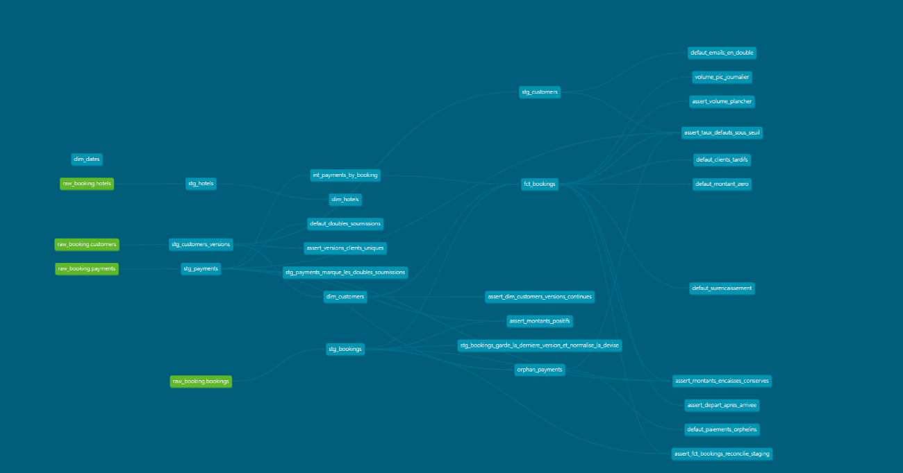

# Booking Data Platform

> Plateforme de données répliquant une base transactionnelle PostgreSQL vers
> BigQuery, en batch puis en change data capture, avec modélisation
> dimensionnelle historisée et orchestration Airflow.

## Le problème métier

Le directeur commercial d'une chaîne hôtelière demande un chiffre simple : le taux d'annulation par segment de clientèle. L'analyste le lui fournit, et il est faux.

Il est faux parce que la base transactionnelle est conçue pour l'écriture, pas pour la mémoire. Le statut de fidélité d'un client est écrasé à chaque promotion, si bien qu'une réservation faite en mars par un client « standard » apparaît aujourd'hui comme une réservation « gold ». Les réservations supprimées sortent purement des statistiques. Et une réservation confirmée puis annulée le même jour est comptée comme une simple annulation, ce qui masque exactement le cas qui intéresse le directeur : les clients qui se rétractent après s'être engagés.

Aucune alerte ne se déclenche, aucun pipeline n'échoue. Le chiffre est simplement plausible et faux. Ce projet s'attaque à cette cause.

## Le modèle source (OLTP)

| Table       | Grain                    | Rôle                                             |
|-------------|--------------------------|--------------------------------------------------|
| `hotels`    | un hôtel                 | ville, nombre d'étoiles                          |
| `customers` | un client                | email, `loyalty_tier` — **change dans le temps** |
| `bookings`  | une réservation          | dates, statut, montant                           |
| `payments`  | un paiement              | **pas de FK vers `bookings`** (cf. ADR-002)      |

## Architecture cible

```
                          ┌──────────────────────────┐
                          │   PostgreSQL 16 (OLTP)   │
                          │  hotels · customers      │
                          │  bookings · payments     │
                          │  wal_level = logical     │
                          └────┬────────────────┬────┘
                               │                │
        extraction incrémentale│                │ CDC — lecture du WAL
        (watermark updated_at) │                │ Debezium
                               ▼                ▼
                        ┌─────────────┐   ┌───────────┐
                        │  Parquet    │   │ Redpanda  │
                        │  data/raw/  │   │  (Kafka)  │
                        └──────┬──────┘   └─────┬─────┘
                               │                │ consumer Python
                               │                │ micro-batch
                               ▼                ▼
                     ┌──────────────────────────────────┐
                     │  BigQuery — raw_booking          │
                     └───────────────┬──────────────────┘
                                     │  dbt
                                     ▼
                     ┌──────────────────────────────────┐
                     │  staging_booking  →  marts_booking│
                     │  dim_* · fct_bookings · SCD2      │
                     └───────────────┬──────────────────┘
                                     ▼
                              Looker Studio

  Orchestration : Airflow (DAG quotidien, backfill idempotent)
  Infra as code : Terraform    CI : GitHub Actions
```
   SOURCE OLTP              INGESTION            ENTREPOT           SERVICE

  +--------------+
  |  PostgreSQL  |  ==[batch]==>  extract  ==>  raw_booking
  |   16 (WAL    |                watermark      (partitionne)
  |   logical)   |                 J7-J9              |
  |              |                                    v
  |  4 tables    |                              staging_booking
  |  + triggers  |                                dbt / vues
  +--------------+                                    |
         ^                                            v
         |                                      marts_booking
  +--------------+                             faits + dimensions
  |  simulateur  |                              SCD2 (J19)
  |   Python     |                                    |
  |  seed /      |                                    v
  |  simulate    |                            .. Looker Studio (J29)
  +--------------+

  .. Debezium -> Redpanda -> consumer  (sprint 5, J21-J25)
  .. Airflow orchestre l'ensemble      (sprint 3, J11-J15)
  .. Terraform + GitHub Actions        (sprint 6, J26-J27)

## Lancer le projet

Prérequis : Docker, Python 3.11+, `make`, et un projet GCP avec un compte
de service ayant accès à BigQuery.

### 1. Configuration

```bash
cp .env.example .env
```

Cinq valeurs à renseigner dans `.env` :

| Variable | Valeur |
|---|---|
| `POSTGRES_PASSWORD` | au choix |
| `GCP_PROJECT_ID` | l'identifiant de ton projet GCP |
| `GOOGLE_APPLICATION_CREDENTIALS` | chemin **absolu** de la clé du compte de service, hors du dépôt |
| `AIRFLOW_UID` | ton UID : `id -u` |
| `FERNET_KEY` | à générer (ci-dessous) |

```bash
python3 -c "from cryptography.fernet import Fernet; print(Fernet.generate_key().decode())"
```

`FERNET_KEY` chiffre les connexions qu'Airflow stocke en base. Elle est
propre à chaque installation : ne jamais la partager ni la commiter.

`AIRFLOW_UID` doit valoir ton UID. Sinon les fichiers écrits dans `data/`
depuis l'hôte sont inaccessibles aux conteneurs, et inversement.

### 2. Base source et données

```bash
make install            # venv + dépendances
source .venv/bin/activate
make check              # démarre Postgres, peuple, teste
```

### 3. Amorçage BigQuery

À lancer **une seule fois**, avant le premier run du DAG :

```bash
make snapshot
```

Le pipeline n'extrait que ce qui change dans une fenêtre. Les lignes
antérieures au `start_date` et jamais modifiées depuis n'arriveraient
jamais en cible : ce chargement les écrit dans une partition dédiée (la
veille du `start_date`), qu'aucune fenêtre régulière ne peut écraser.
Voir ADR-029.

Sur une base fraîchement peuplée, cela représente environ 80 % des
réservations. Sans cette étape, `raw_booking.hotels` n'existe pas et les
dimensions sont incomplètes.

### 4. Orchestration

Airflow est derrière un profil Compose : il ne démarre pas avec `make up`.

```bash
make airflow            # démarre les 4 services (~1 min)
make dag-on             # active ingestion_batch, le rattrapage part seul
```

L'interface est sur http://localhost:8080. Le rattrapage crée un run par
journée écoulée depuis le `start_date` (01/09/2026), exécutés un par un.
La journée en cours n'est jamais traitée : son run part à minuit, une fois
la fenêtre close (ADR-028).

```bash
make airflow-down       # libère la mémoire quand Airflow n'est pas utile
```

## Décisions d'architecture

Voir [DECISIONS.md](./DECISIONS.md).

## Modèle et qualité des données



- **Schéma en étoile** : `fct_bookings` (grain : une réservation), dimensions
  clients (SCD2), hôtels, dates.
- **SCD2** : le palier de fidélité au moment de la réservation. Une jointure
  sur la version courante attribuerait le mauvais palier à 21 % des
  réservations (mesuré le 24/09).
- **Tests** : invariants en `error`, six défauts de source connus comptés en
  `warn`, dérive des taux en `error` ([ADR-036](DECISIONS.md)).
