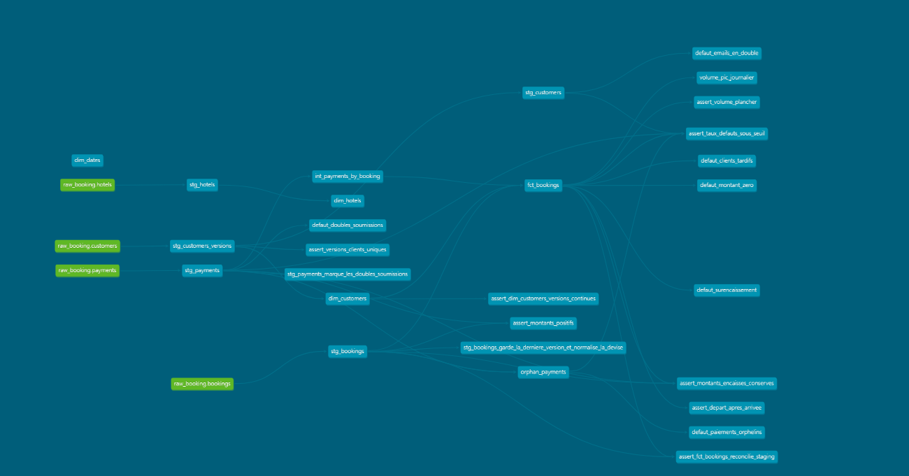
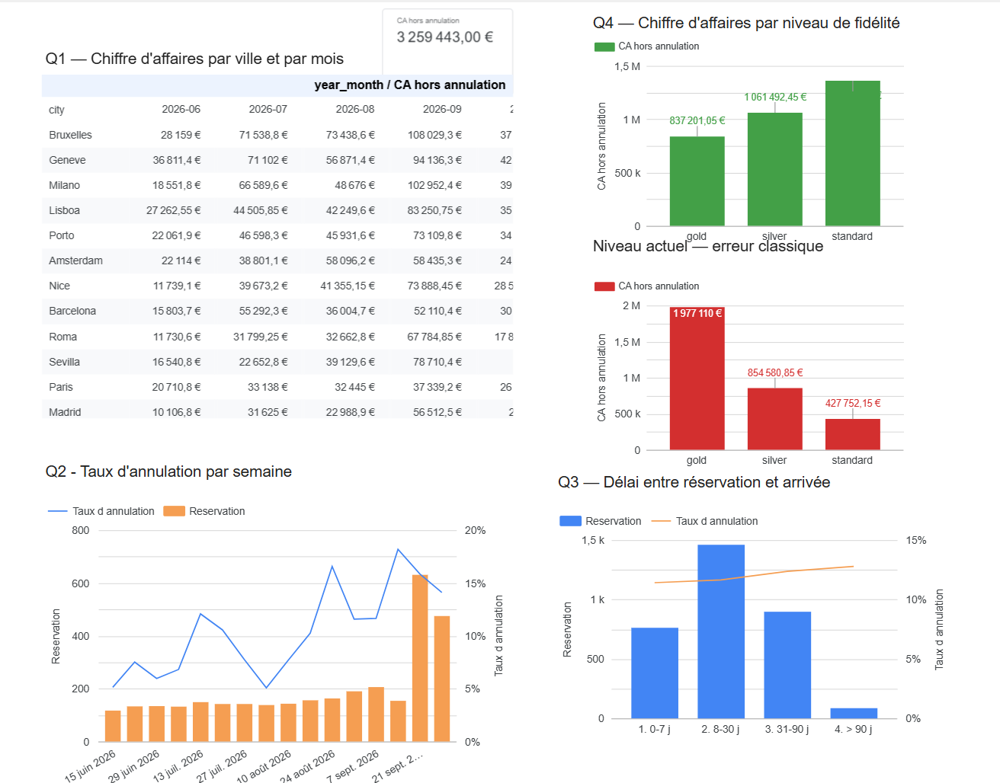
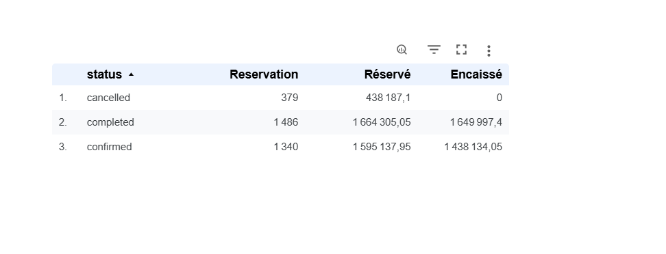

# Booking Data Platform


> Plateforme de données répliquant une base transactionnelle PostgreSQL vers
> BigQuery, d'abord en batch, puis en change data capture (Debezium, Redpanda),
> avec modélisation dimensionnelle historisée (SCD2), orchestration Airflow,
> infrastructure Terraform et CI GitHub Actions.

## Le problème métier

Le directeur commercial d'une chaîne hôtelière demande un chiffre simple : le
taux d'annulation par segment de clientèle. L'analyste le lui fournit, et il est
faux.

Il est faux parce que la base transactionnelle est conçue pour l'écriture, pas
pour la mémoire. Le statut de fidélité d'un client est écrasé à chaque
promotion, si bien qu'une réservation faite en mars par un client « standard »
apparaît aujourd'hui comme une réservation « gold ». Les réservations supprimées
sortent purement des statistiques. Et une réservation confirmée puis annulée le
même jour est comptée comme une simple annulation, ce qui masque exactement le
cas qui intéresse le directeur : les clients qui se rétractent après s'être
engagés.

Aucune alerte ne se déclenche, aucun pipeline n'échoue. Le chiffre est
simplement plausible et faux. Ce projet s'attaque à cette cause.

## Résultats en chiffres

Mesurés sur le projet, sur des données simulées (voir les
[biais](docs/limites.md#2-biais-du-jeu-de-données)).

| Constat | Mesure | Détail |
|---|---|---|
| Le batch perd les états intermédiaires | **21 transitions sur 209 perdues** (10 %) : une réservation sur neuf ayant changé d'état a changé plus d'une fois | [limites-batch](docs/limites-batch.md) |
| Le batch garde les lignes supprimées | **17 réservations fantômes** en batch ; **0 écart** sur 3 205 identifiants avec le CDC | [batch-vs-cdc](docs/batch-vs-cdc.md) |
| Latence du CDC | 76 à 874 ms jusqu'au topic, puis micro-batch ≤ 5 min | [batch-vs-cdc](docs/batch-vs-cdc.md) |
| Plantage du consommateur | **0 perte**, 1 000 doublons absorbés par le dédoublonnage dbt (at-least-once) | ADR-038 |
| Historisation SCD2 | Sur la version actuelle du client, gold reçoit **+136 %** de son vrai CA et standard **−69 %**, à total identique (mesuré le 07/10) | [dashboard](docs/dashboard.md) |
| Stockage colonnaire | **20,5 fois moins d'octets lus** (−95,1 %) | [optimisation](docs/optimisation-bigquery.md) |
| Partitionnement | −77 % d'octets lus sur 7 jours, mais **0 % de gain facturé** (plancher de 10 Mo) et 32 % des lignes perdues à l'expiration du bac à sable → clustering seul | ADR-033 |
| Qualité | **94 tests automatisés** : 63 tests dbt, 31 tests pytest | ADR-036 |

La démarche compte autant que les chiffres : le CDC a été adopté **après**
avoir mesuré ce que le batch ratait (ADR-014), pas avant.

## Architecture
          PostgreSQL 16 (OLTP)  ◄──── simulateur Python (seed / simulate)
     hotels · customers · bookings · payments
                wal_level = logical
             │                          │

extraction incrémentale CDC : lecture du WAL
(watermark updated_at) Debezium (Kafka Connect)
│ │
▼ ▼
Parquet data/raw/ Redpanda (Kafka)
│ │ consommateur Python
│ load job │ micro-batch, at-least-once
▼ ▼
raw_booking raw_booking_cdc
└────────────┬─────────────┘
▼ dbt
staging_booking → marts_booking
dim_customers (SCD2) · dim_hotels · dim_dates
fct_bookings (CDC) · rpt_bookings_dashboard
▼
Looker Studio

Orchestration : Airflow (DAG quotidien, backfill par intervalle)
Infrastructure : Terraform · CI : GitHub Actions + pre-commit


### Stack et justification

| Brique | Choix | Pourquoi | ADR |
|---|---|---|---|
| Environnement | Docker Compose, profils `airflow` et `cdc` | reproductible, remise à zéro instantanée ; on ne démarre que ce qu'on utilise | 001 |
| Source | PostgreSQL 16, `REPLICA IDENTITY FULL` | l'état « avant » complet dans chaque événement CDC | 003 |
| Batch | Python, watermark `>` avec marge, Parquet | écrire puis avancer : un échec ne fait jamais sauter de lignes | 009, 010 |
| CDC | Debezium → Redpanda → consommateur Python | capture suppressions et états intermédiaires ; Redpanda est compatible Kafka, en un seul binaire | 014, 037, 038 |
| Entrepôt | BigQuery, région EU, bac à sable | serverless, chargements gratuits ; pas de compte de facturation | 006, 008, 045 |
| Transformation | dbt | SQL versionné, testé, documenté ; SCD2 reconstruit depuis la raw | 030, 034, 036 |
| Orchestration | Airflow, LocalExecutor | fenêtre dérivée de l'intervalle de données : backfill idempotent | 020, 028 |
| Infrastructure | Terraform | datasets, compte de service et rôles au moindre privilège | 042–044 |
| CI | GitHub Actions + pre-commit | lint, tests hors BigQuery, environnement figé | 046–049 |
| BI | Looker Studio sur une vue dédiée | la vue est le contrat entre le modèle et l'outil | 050 |

Toutes les décisions, avec les options écartées : [DECISIONS.md](DECISIONS.md).

## Le modèle source (OLTP)

| Table | Grain | Rôle |
|---|---|---|
| `hotels` | un hôtel | ville, nombre d'étoiles |
| `customers` | un client | email, `loyalty_tier` — **change dans le temps** |
| `bookings` | une réservation | dates, statut, montant |
| `payments` | un paiement | **pas de FK vers `bookings`** (ADR-002) |

Le simulateur injecte volontairement des défauts : paiements orphelins,
suppressions physiques, changements de niveau, doubles soumissions (ADR-005).

## Modèle analytique et qualité



- **Schéma en étoile** : `fct_bookings` (grain : une réservation), dimensions
  clients (SCD2), hôtels, dates. `fct_bookings` lit le CDC ; les suppressions
  sont filtrées par une définition unique des réservations actives (ADR-039).
- **SCD2** : le niveau de fidélité est celui **au moment de la réservation**.
  Une jointure sur la version actuelle attribue un mauvais niveau à 49 % des
  réservations (mesuré le 07/10, voir les biais du simulateur).
- **Tests** : invariants en `error`, défauts de source connus comptés en `warn`,
  dérive des taux en `error` (ADR-036). Les paiements orphelins sont exposés
  dans une table dédiée : comptés, jamais cachés.

## Dashboard




Cinq questions métier, dont la principale : le CA par niveau de fidélité **au
moment de la réservation**, comparé à la version naïve. Définitions et
contrôles croisés : [docs/dashboard.md](docs/dashboard.md).

## Lancer le projet

Prérequis : Docker (8 Go de RAM pour Airflow et le CDC ensemble), Python 3.11+,
`make`, Terraform, et un projet GCP avec un compte de service ayant accès à
BigQuery.

### 1. Configuration

```bash
cp .env.example .env
```

Cinq valeurs à renseigner dans `.env` :

| Variable | Valeur |
|---|---|
| `POSTGRES_PASSWORD` | au choix |
| `GCP_PROJECT_ID` | |
| `GOOGLE_APPLICATION_CREDENTIALS` | chemin **absolu** de la clé du compte de service, hors du dépôt |
| `AIRFLOW_UID` | ton UID : `id -u` |
| `FERNET_KEY` | à générer (ci-dessous) |

```bash
python3 -c "from cryptography.fernet import Fernet; print(Fernet.generate_key().decode())"
```

`FERNET_KEY` chiffre les connexions qu'Airflow stocke en base. Elle est propre
à chaque installation : ne jamais la partager ni la commiter.

`AIRFLOW_UID` doit valoir ton UID. Sinon les fichiers écrits dans `data/`
depuis l'hôte sont inaccessibles aux conteneurs, et inversement.

### 2. Base source et données

```bash
make install            # venv + dépendances
source .venv/bin/activate
make check              # démarre Postgres, peuple, teste
make simulate           # fait vivre la base : statuts, modifications, suppressions
```

### 3. Amorçage BigQuery

À lancer **une seule fois**, avant le premier run du DAG :

```bash
make snapshot
```

Le pipeline n'extrait que ce qui change dans une fenêtre. Les lignes
antérieures au `start_date` et jamais modifiées depuis n'arriveraient jamais en
cible : ce chargement les écrit dans une partition dédiée (la veille du
`start_date`), qu'aucune fenêtre régulière ne peut écraser. Voir ADR-029.

Sur une base fraîchement peuplée, cela représente environ 80 % des
réservations. Sans cette étape, `raw_booking.hotels` n'existe pas et les
dimensions sont incomplètes.

### 4. Orchestration

Airflow est derrière un profil Compose : il ne démarre pas avec `make up`.

```bash
make airflow            # démarre les 4 services (~1 min)
make dag-on             # active ingestion_batch, le rattrapage part seul
```

L'interface est sur http://localhost:8080. Le rattrapage crée un run par
journée écoulée depuis le `start_date` (01/09/2026), exécutés un par un.
La journée en cours n'est jamais traitée : son run part à minuit, une fois
la fenêtre close (ADR-028).

### 5. Change data capture

```bash
docker compose --profile cdc up -d       # Redpanda + Kafka Connect (Debezium)
curl -X POST http://localhost:8083/connectors \
  -H "Content-Type: application/json" -d @debezium/connector-postgres.json
python -m ingestion.cdc_consumer         # micro-batchs vers raw_booking_cdc
```

Le connecteur crée un slot de réplication. Un slot que personne ne consomme
retient le WAL : il est borné à 1 Go (ADR-037). Arrêter le CDC sans supprimer
le connecteur laisse donc le slot actif.

### 6. Transformations

```bash
cd dbt/booking_analytics
dbt build                                # modèles et tests
dbt docs generate && dbt docs serve      # lineage sur http://localhost:8080
```

### 7. Infrastructure

```bash
cd terraform
cp terraform.tfvars.example terraform.tfvars   # projet et région
terraform init && terraform plan && terraform apply
```

Terraform crée les datasets BigQuery, le compte de service et ses rôles au
moindre privilège. Le state est local (ADR-043) : il contient des données
sensibles et n'est jamais commité.

### Tout arrêter et nettoyer

```bash
make airflow-down
docker compose --profile cdc down
make down
cd terraform && terraform destroy        # supprime les ressources GCP
```

`terraform destroy` supprime les datasets et leur contenu, le compte de
service et ses rôles. Dans un projet avec facturation, c'est la garantie de ne
rien laisser tourner, ni payer.

## Documentation

| Document | Contenu |
|---|---|
| [DECISIONS.md](DECISIONS.md) | 50 décisions d'architecture, avec un index |
| [docs/limites-batch.md](docs/limites-batch.md) | la mesure qui a justifié le CDC |
| [docs/attentes-cdc.md](docs/attentes-cdc.md) | les prédictions écrites avant de coder le CDC |
| [docs/batch-vs-cdc.md](docs/batch-vs-cdc.md) | le comparatif chiffré |
| [docs/optimisation-bigquery.md](docs/optimisation-bigquery.md) | octets scannés, avant et après |
| [docs/dashboard.md](docs/dashboard.md) | les cinq questions métier et leurs définitions |
| [docs/runbook.md](docs/runbook.md) | procédures d'incident |
| [docs/limites.md](docs/limites.md) | ce qui ne passerait pas en production |
| [JOURNAL.md](JOURNAL.md) | le journal des 30 jours, erreurs comprises |

## Limites

Ce projet n'est pas prêt pour la production, et [docs/limites.md](docs/limites.md)
dit pourquoi. Les trois points principaux :

1. **Bac à sable BigQuery** : les tables expirent à 60 jours, et l'historique
   SCD2, reconstruit depuis la raw, disparaît avec elles.
2. **Architecture hybride** : les faits viennent du CDC, certaines dimensions
   encore du batch, d'où des désynchronisations possibles.
3. **Alertes manuelles** : les requêtes de santé existent, mais personne n'est
   prévenu sans les lancer. Le CI est d'ailleurs resté rouge deux jours sans
   être remarqué.
